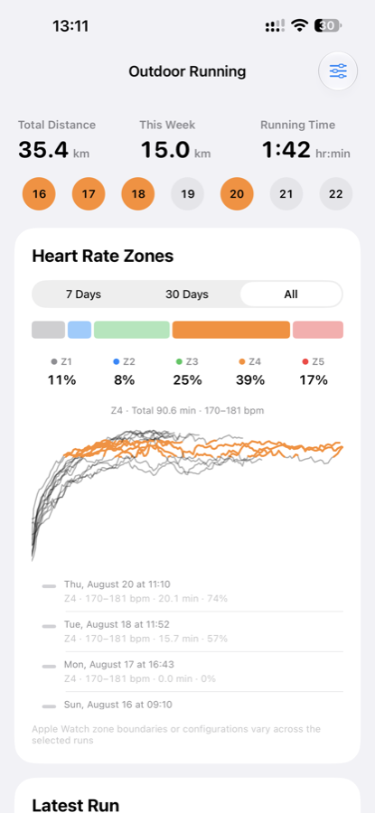
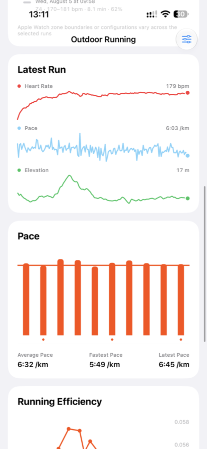
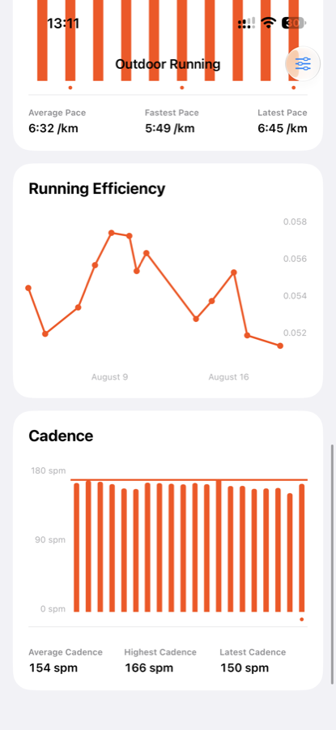

# Fitness

Fitness is a native iPhone app for understanding outdoor runs recorded by Apple Watch. It turns HealthKit workout data into a focused view of weekly volume, heart-rate zones, pace, cadence, elevation, and running efficiency.

The goal is simple: show the numbers that help explain a run without making the runner interpret raw health data.

<p align="center">
  
  
  
</p>

## What it shows

- **Weekly training summary** — total distance, distance this week, running time, and active days.
- **Apple Watch heart-rate zones** — time and percentage in each recorded zone across 7 days, 30 days, or the full history.
- **Latest-run timeline** — heart rate, pace, and route elevation plotted over the same run.
- **Pace** — per-kilometre splits with average, fastest, and latest pace.
- **Running efficiency** — speed relative to heart rate, tracked over time. A higher value means more speed for each heartbeat; it is most useful for comparing similar runs under similar conditions.
- **Cadence** — steps per minute throughout each run, plus average, highest, and latest values.
- **Run selection and CSV export** — include only the workouts you want to compare, then export the selected HealthKit data when needed.

## How it works

Fitness requests read-only access to running workouts in Apple Health. It loads outdoor runs and their related HealthKit samples, processes them off the main thread, and presents immutable results in SwiftUI charts.

```text
Apple Watch / Apple Health
            │
            ▼
HealthKitManager actor ── bounded workout and sample queries
            │
            ▼
HealthDataProcessor ───── splits, cadence, timelines, efficiency
            │
            ▼
HealthDataStore ──────── protected short-term cache and refresh state
            │
            ▼
SwiftUI + Swift Charts ── interactive analytics cards
```

The app uses the heart-rate-zone configuration stored with each Apple workout. It does not estimate zones from age or maximum heart rate, and it does not invent missing zone data. If selected workouts use different zone boundaries, the interface says so.

Running efficiency is calculated as average running speed in kilometres per hour divided by average heart rate in beats per minute. The calculation excludes the first two minutes, pause periods, invalid samples, and statistical outliers. It is a trend indicator, not a medical measurement or a substitute for pace, perceived effort, terrain, or weather.

## Privacy

- Health data is read from HealthKit and is not uploaded by the app.
- Normal analysis asks only for workout, distance, heart rate, speed, stride, and step data.
- Additional workout details and route points are requested only when the user starts an export.
- Processed data is cached locally with complete file protection, excluded from backups, and refreshed after 15 minutes.
- CSV files are generated on demand and deleted after sharing or leaving the export screen.
- The app does not write to HealthKit and has no third-party dependencies.

## Technical details

- SwiftUI application using Swift Charts
- HealthKit queries isolated in a Swift actor
- `@MainActor` observable store for UI state
- Bounded concurrent workout loading
- Codable, versioned derived-data cache
- English and Simplified Chinese localization
- XCTest coverage for data processing, privacy, cache behavior, and production safety

### Requirements

- Xcode 27
- iOS 27.0 or later
- An iPhone with Apple Health data
- Apple Watch outdoor-running workouts for the complete set of metrics

The project intentionally targets the iOS 27 SDK and Apple Workout Zones API. Use an Apple-supported stable Xcode release before producing an App Store archive.

## Build

Open `Fitness.xcodeproj` in Xcode and run the shared `Fitness` scheme, or build from the command line:

```sh
DEVELOPER_DIR=/Applications/Xcode-beta.app/Contents/Developer \
xcodebuild -project Fitness.xcodeproj -scheme Fitness \
  -configuration Debug -destination 'generic/platform=iOS Simulator' \
  CODE_SIGNING_ALLOWED=NO SWIFT_STRICT_CONCURRENCY=complete build-for-testing
```

A simulator can build the interface, but HealthKit authorization and real workout data must be tested on a signed physical device. See [RELEASE_CHECKLIST.md](RELEASE_CHECKLIST.md) for the full device, accessibility, privacy, and release verification list.
